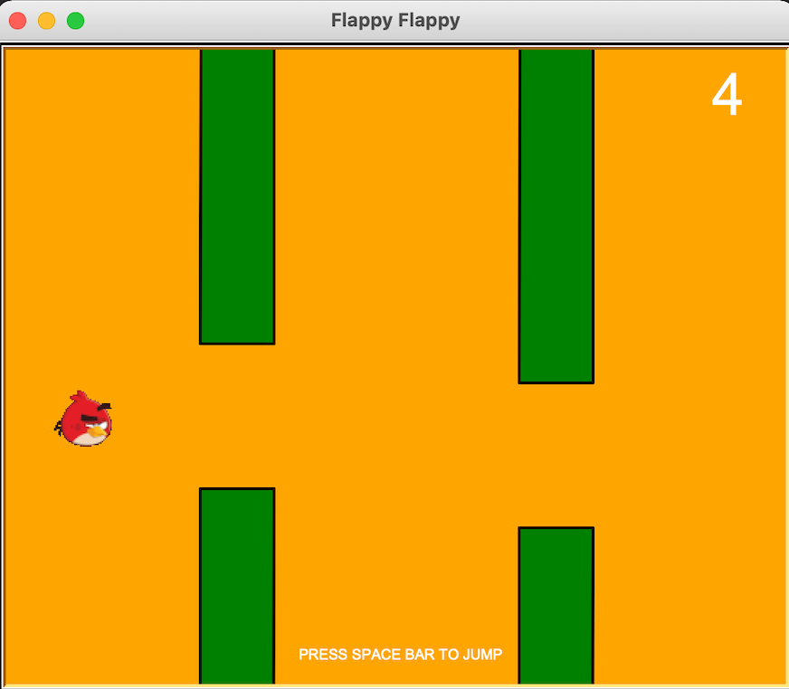

# Flappy Flappy

My project is Flappy Flappy. It seems like a Flappy bird game. You have to control the bird to avoid the obstacle
(rectangle) and through the gap.

## Overview and Features

Before you play the game you have to type your name to keep the score in your name to show if you are the best score at
the end. Game play like a flappy bird game. You have to control (press space bar to jump) the bird to avoid the obstacle
(rectangle) and through the gap.

## Libraries and Tools

    ## Python Version - 3.9.5 ##
    
    ## Libraries - Turtle, Screen, csv, copy, random

    ## The picture of the bird as a gif file (bird.gif)

## Module

There are six module for this project.

* `vector.py` define x-axis and y-axis.
* `bird.py` draw the bird and update position of bird.
* `pipe.py` draw the upper, lower pipe(rectangle) and update position of pipe.
* `stage.py` create screen and create all object that displayed on the screen.
* `main.py` to run code and displayed on screen.

### 1. Module `vector.py`

This module contains the `Vector` class to define x-axis and y-axis for the `Bird` object, `Pipe` object.

* `__init__` initialize the `Vector` object with x (position of x-axis), y (position of y-axis) attribute and x, y must
  be a number.

### 2. Module `bird.py`

This module contains the `Bird` class to draw the bird and update position of bird.

* `__init__` initialize the `Bird` object with pos (position x,y) attribute and pos must be a `Vector` object.
* `draw` draw the shape of bird with Turtle graphic.
* `update` define the y-axis to update new position and use for jump.

### 3. Module `pipe.py`

This module contains the `Pipe` class to draw the upper pipe and lower pipe and update position of pipe. I draw the pipe
as a rectangle

* `__init__` initialize the `Pipe` object with corner, width, height attribute and corner must be a `Vertor` object and
  width, height must be a number.
* `draw_pipe_up` draw the upper pipe as a rectangle.
* `draw_pipe_down` draw the lower pipe as a rectangle.
* `update` update the x-axis to make the pipe move.

### 4. Module `data.py`

This module contains the `DATA` class to read and write `csv` file score each name

* `__init__` initialize the `DATA` object with name (str), score (number), list_of_score (list of dict that key:name
  value:score) attribute.
* `insert` read and write data file, create `score.csv` text file to keep the score each name.
* `score_name` to create dict from `score.csv` and send to the list_of_score

### 5. Module `stage.py`

This module contains the `Stage` class to create screen and create all object that displayed on the screen. This class
contains a list of objects.

* `__init__` initialize the `Stage` object with pipe (list of object), bird (Bird object), data (DATA object), painter (
  Turtle), angry_bird (Turtle), screen (Screen) attribute.
* `init_screen` create the screen.
* `add_pipe` received many `Pipe` object from `main.py` and append the `Pipe` object to the list of object.
* `update_pipe` updates each `Pipe` object that contains in the list.
* `render_pipe` create the `Pipe` with Turtle.
* `render_bird` create the `Bird` with Turtle.
* `press_bird` press space bar to update y position to make the bird move up.
* `jump` to move the bird with gravity.
* `check_crash` to check the bird that crash the pipe or not.
* `text` create text on the screen.
* `score` display score on the screen.

### 6. Module `main.py`

This module use for run the code and displayed all objects in the screen and define many values in here.